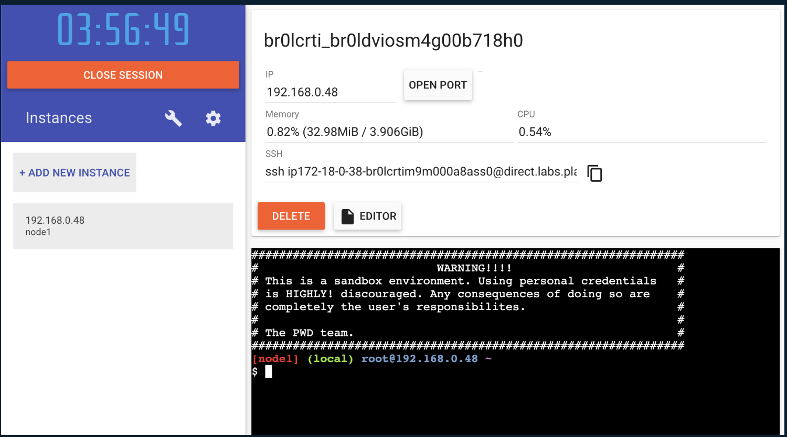

# Purpose
Get the basics of Docker by completing their Getting Started tutorial

# Notes
## On the workings of Docker
- Docker images are instances of our work
    - Create an image from a directory with a Dockerfile
    ```
    docker build [path to dir with Dockerfile]
    ```
- Docker containers are instances of our running image
    - Create and start a container from an image
    ```
    docker run [options] [image name]
    ```
    - Containers run a single process
    - If two containers are on the same network, they can talk to each other. If they aren't, they can't.
- Volumes allow us to persist and share data between containers
    - Create a volume   
        ```
        docker volume create [volume name]
        ```   
    If you invoke a volume name in a `docker run` command without having defined the voluem first, Docker will know to create the volume for you automatically
    - Start a new container with the volume
        ```
        docker run -v [volume name:/path/in/container] [image name]
        ```
    - Inspect the volume
        ```
        docker volume inspect [volume name]
        ```
- Networks allow us to share information
    - Create the network
        ```
        docker network create [network name]
        ```

## Test your image on a new instance with Play with Docker
1. Open your browser to [Play with Docker](https://docs.docker.com/get-started/04_sharing_app/#:~:text=your%20browser%20to-,Play%20with%20Docker,-.)
1. Click Login and select docker from the drop-down list.
1. Connect with your Docker Hub account.
1. Once you're logged in, click on the ADD NEW INSTANCE option on the left side bar. If you don't see it, make your browser a little wider. After a few seconds, a terminal window opens in your browser.


## Helpful Docker commands
### How to shell into a new container from an image
`docker run -it [image name] /bin/sh`

### How to shell into a running container
`docker exec -it [container name] /bin/sh`

### Watch container logs
`docker logs -f [container name]`

## A little bit on SQLite
- By default the SQLite database in our project will store its data at /etc/todos/todo.db in our container

## A little bit on MySQL
- By default it stores data in /var/lib/mysql
- It's necessary for the client-side application to have some credentials for MySQL in order for them to be able to access the database's resources. These credentials are provided into our client-side app in the `app/src/persistence/mysql.js` file.
- To confirm you have the database up and running
    1. Connect to the db and verify it connects
        ```
        docker exec -it [my-sql container id] mysql -u root -p
        ```
    1. When the password prompt comes up, type in `secret`
    1. List the databases, and verify you see `todos`
        ```
        mysql> SHOW DATABASES;
        ```
- 

# Resources
## VS Code Docker extension
## Docker docs
Find the guide to this Getting started [here](https://docs.docker.com/get-started)
