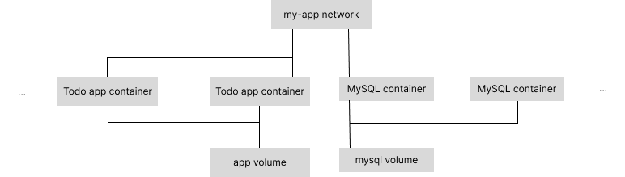
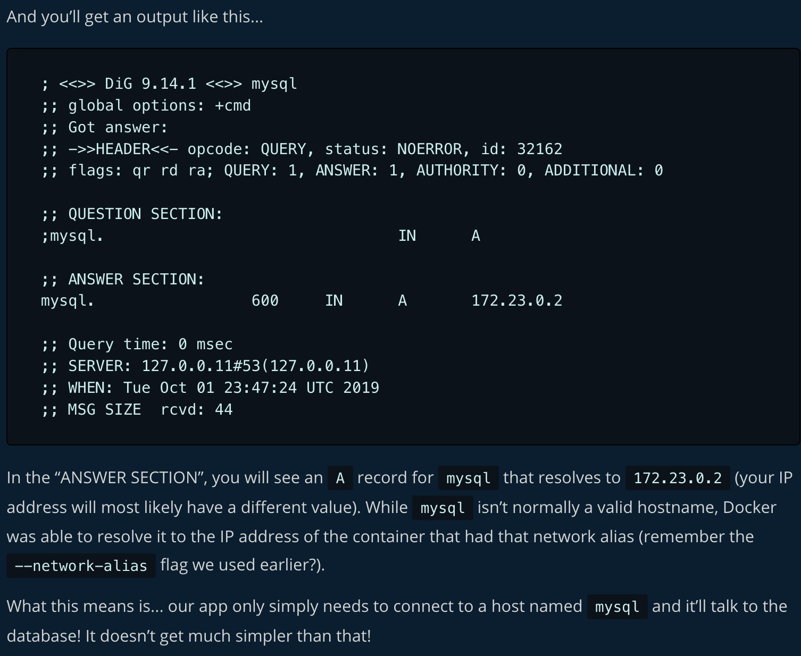

# Purpose
Get the basics of Docker by completing their Getting Started tutorial
## The Structure
This application is made up of a development environment and database instance, where the aim is to achieve a controlled development environment separate from the database instance and still have changes made to both these environments persist beyond the container, and have these environments communicate.   
The application is made up of the following components:
- the `Todo app container`
- the `app volume`
- the `my-app network`
- the `MySQL container`
- the `mysql volume`

### `Todo app container`
The `Todo app container` is the container which runs an image of the development environment. The development environment has three main functions:
1. Enable the developer to work in a contained environment   
    This is done by nature of the docker container's image
1. Persist changed files in the work directory   
    This is done through use of docker volume `app volume`
1. Connect to the MySQL database container during development   
    This is done through use of networks, specifically by running the container on the `my-app network`

See `dev/start-dev-container-with-mysql-credentials.sh` to see the exact docker container run command, complete with all configuration information
### `app volume`
The `app volume` docker volume is the volume consumed by the `Todo app container`. It allows us to persist our changes to the `./app` code base beyond our container.
### `my-app network`
The docker network `my-app network` is what allows for communication between the `Todo app container` container and the `MySQL container`. It is through this network that we are able to connect to the `MySQL container` in order to have an impact on the MySQL database contained therein.
### `MySQL container`
The `MySQL container` is the container which runs an image of MySQL; this ships with a MySQL database ready for configuration and use. This container has two main functions:
1. Accept connection from and handle incoming requests from the `Todo app container`.    
    In order to make connection on the `my-app network` easier from the `Todo app container`, this container is run specifying a network alias that `Todo app container` can use to connect to. This connection is made in `dev/start-dev-container-with-mysql-credentials.sh`, if you want to have a look
1. Persist database state between different `MySQL container` instances. This is done through the use of volumes.

See `dev/start-mysql-container.sh` for the exact command used to run the `MySQL container` with the proper configuration.

### `mysql volume`
The purpose of the `mysql volume` is to persist database state between different instances of the `MySQL container`.


# Notes
## On the workings of Docker
- Docker images are instances of our work
    - Create an image from a directory with a Dockerfile
    ```
    docker build [path to dir with Dockerfile]
    ```
- Docker containers are instances of our running image
    - Create and start a container from an image
    ```
    docker run [options] [image name]
    ```
    - Containers run a single process
    - If two containers are on the same network, they can talk to each other. If they aren't, they can't.
- Volumes allow us to persist and share data between containers
    - Create a volume   
        ```
        docker volume create [volume name]
        ```   
    If you invoke a volume name in a `docker run` command without having defined the voluem first, Docker will know to create the volume for you automatically
    - Start a new container with the volume
        ```
        docker run -v [volume name:/path/in/container] [image name]
        ```
    - Inspect the volume
        ```
        docker volume inspect [volume name]
        ```
- Networks allow us to share information
    - Create the network
        ```
        docker network create [network name]
        ```
    - You can start containers and add them to the network, giving them an alias to make them easier to connect to from other containers on the same network
        ```
        ex.
        # mysql container

        docker network create $NETWORK_NAME
        docker run -d \
            --network $NETWORK_NAME \
            --network-alias $MYSQL_CONTAINER_NETWORK_ALIAS \ # This is this container's alias on the network
            --platform "linux/amd64" \ #Mac Silicon only
            -v $VOLUME_NAME:/var/lib/mysql \
            -e MYSQL_ROOT_PASSWORD=secret \
            -e MYSQL_DATABASE=$TABLE_NAME \
            mysql:5.7

        # front end container
        docker run -dp $PORT:3000 \
            -w "/$WORKING_DIRECTORY" \
            -v "$PROJECT_ROOT/$WORKING_DIRECTORY:/$WORKING_DIRECTORY" \
            --network $NETWORK_NAME \
            -e MYSQL_HOST=$MYSQL_CONTAINER_NETWORK_ALIAS \ #Note here we specify the MySQL container's network alias
            -e MYSQL_USER=root \
            -e MYSQL_PASSWORD=secret \
            -e MYSQL_DB=$TABLE_NAME \
            node:12-alpine \
            sh -c "yarn install && yarn run dev"
        ```

## Test your image on a new instance with Play with Docker
1. Open your browser to [Play with Docker](https://docs.docker.com/get-started/04_sharing_app/#:~:text=your%20browser%20to-,Play%20with%20Docker,-.)
1. Click Login and select docker from the drop-down list.
1. Connect with your Docker Hub account.
1. Once you're logged in, click on the ADD NEW INSTANCE option on the left side bar. If you don't see it, make your browser a little wider. After a few seconds, a terminal window opens in your browser.


## Helpful Docker commands
### How to shell into a new container from an image
`docker run -it [image name] /bin/sh`

### How to shell into a running container
`docker exec -it [container name] /bin/sh`

### Watch container logs
`docker logs -f [container name]`

## A little bit on SQLite
- By default the SQLite database in our project will store its data at /etc/todos/todo.db in our container

## A little bit on MySQL
- By default it stores data in /var/lib/mysql
- It's necessary for the client-side application to have some credentials for MySQL in order for them to be able to access the database's resources. These credentials are provided into our client-side app in the `app/src/persistence/mysql.js` file.
- To confirm you have the database up and running
    1. Connect to the db and verify it connects
        ```
        docker exec -it [my-sql container id] mysql -u root -p
        ```
    1. When the password prompt comes up, type in `secret`
    1. List the databases, and verify you see `todos`
        ```
        mysql> SHOW DATABASES;
        ```
    1. provide your frontend container with the db credentials
        `see dev/start-dev-container-with-mysql-credentials.sh`
    1. Try adding something to the db via `localhost:3000`
    1. Shell into the db and do the following
        1. `mysql -u root -p`
        1. password is `secret`
        1. `mysql> SHOW DATABASES;`
        1. `mysql> SELECT * FROM todos.todo_items`
            You should see your added todos here
## A little bit on `nicolaka/netshoot`
- `nicolaka/netshoot` is a Docker image we can use to debug networking issues. We're going to be creating containers from this image targeted to our created docker networks.
    - Run the container
        ```
        docker run -it \
            --network [network name] \
            nicolaka/netshoot
        ```
    - Assuming you started a MySQL container as follows
        ```
        docker run -d \
            --network todo-app \
            --network-alias mysql \ # This is this container's alias on the network
            --platform "linux/amd64" \ #Mac Silicon only
            -v todo-mysql-data:/var/lib/mysql \
            -e MYSQL_ROOT_PASSWORD=secret \
            -e MYSQL_DATABASE=todos \
            mysql:5.7
        ```
    - Look up the IP address for host name `mysql` (this is the aforementioned MySQL container's network alias)
        ```
        dig mysql
        ```
        
    


# Resources
## VS Code Docker extension
## Docker docs
Find the guide to this Getting started [here](https://docs.docker.com/get-started)
## `nicolaka/netshoot`
This is a container which ships with a lot of tools that are useful for troubleshooting or debugging networking issues. In this Getting Started guide, we're going to use it to find the IP address of our MySQL container when it's connected to the `todo-app` network
